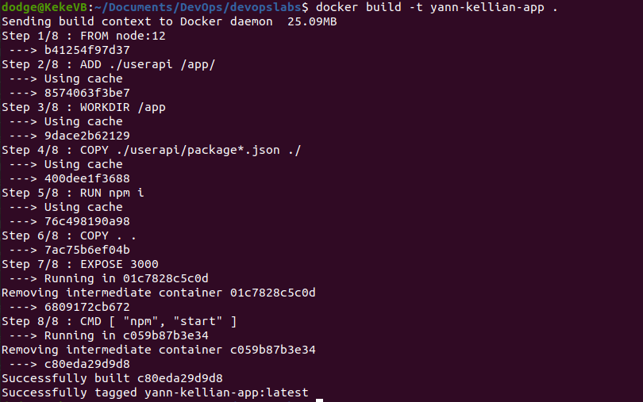
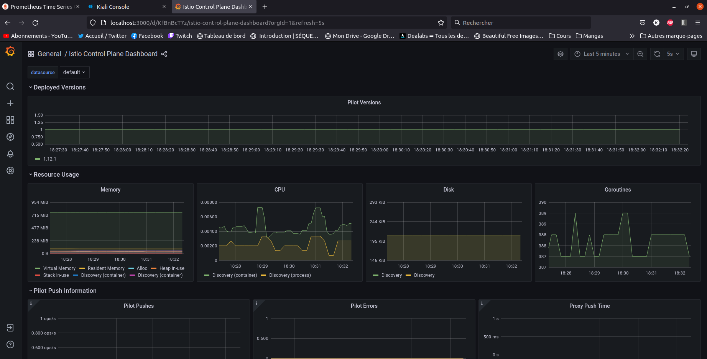

# Dev Ops Project Repository

Hello. This is the repository for the DevOps project held by:

KUDINOV Sergei

# Table of Contents

- [Dev Ops Project Repository](#dev-ops-project-repository)
- [Table of Contents](#table-of-contents)
- [Authors](#authors)
- [Features](#features)
	- [1. Web Application](#1-web-application)
	- [2. CI/CD Pipeline](#2-cicd-pipeline)
		- [CI](#ci)
		- [CD](#cd)
	- [3. Vagrant, IaC](#3-vagrant-iac)
	- [4. Build a docker image of the web app](#4-build-a-docker-image-of-the-web-app)
		- [Create the Dockerfile](#create-the-dockerfile)
		- [Upload the image](#upload-the-image)
	- [5. Docker-compose](#5-docker-compose)
	- [6. Kubernetes](#6-kubernetes)
	- [7. Istio](#7-istio)
		- [Istio download](#istio-download)
		- [Istio installation](#istio-installation)
		- [Istio deployment using automatic envoy proxies](#istio-deployment-using-automatic-envoy-proxies)
		- [Traffic management - Open the application to outside traffic](#traffic-management---open-the-application-to-outside-traffic)
		- [Request routing](#request-routing)
		- [Traffic shifting](#traffic-shifting)
	- [Monitoring](#monitoring)
		- [Kiali dashboarding](#kiali-dashboarding)
			- [Installation](#installation)
			- [Usage](#usage)
		- [Prometheus](#prometheus)
			- [Installation](#installation-1)
			- [Usage](#usage-1)
		- [Grafana](#grafana)
			- [Installation](#installation-2)
			- [Usage](#usage-2)

# Authors

We're two members of ING 4 SI Inter at ECE Paris : 

MESSALATI Yann

COTTART Kellian

# Features


## 1. Web Application

We created a web application using NodeJS storing data inside of a Redis database. 
This web application uses tests that are located inside of the `test` folder.

This application is the same as in module 04, with all of the "TODO" sections implemented.

We also added the capacity to see if the connection with the database was succesfully executed by showing a "**redis is connected**" or "**redis not connected**" message on the front page. This was implemented thanks to **zsimo's node redis retry strategy**.

> https://github.com/zsimo/node-redis-retry-strategy


## 2. CI/CD Pipeline

### CI

First, we created some unit-tests inside of our app, allowing for a test suite to be created.

To implement Continuous Integration, we used GithubActions. We created the `.github/worflows/redis-docker-tests-CI.yml` file.

Using a Redis image and the repository, we set up the file to be able to run a Ubuntu using Redis, as well as a NodeJS basic system to host our file. This allows our unit-tests to run in the background on every push on the main branch.

We're checking if our app works on node 14 and 16 using a matrix strategy.

We could have implemented it on every push of all branches, however GithubActions is limited in its duration of use (only up to 3000 minutes) and we're almost over the limit, so we restrained it.

If it fails, it sends us an email, warning us about the failing of these tests.

### CD

## 3. Vagrant, IaC

//Yann TODO

## 4. Build a docker image of the web app

### Create the Dockerfile

* Write a `Dockerfile` in the main folder of the repository defining the parent image, working dir and instructions to create the image

* Write a `.dockerignore` to be sure not to take in unwanted data

* Check if the redis connection is set to `"host": "redis"` and `"port": 6379` in `userapi\conf\default.json`. This is only for the container part because local tests need to be run with `"host": "127.0.0.1"`.

* Build the image using `docker build -t yann-kellian-app .`



* Run the container using `docker run -p 3000:3000 -d yann-kellian-app`

* Check if it works going to `localhost:3000` or by running `docker ps`. Cool, it does.


> Note: Of course, Redis doesn't work because it is not a docker-compose. For now, it is just our base application.

* We can stop our container using `docker ps` and `docker stop [id_of_our_container]`

### Upload the image

* First, we created a repo on docker hub

* We tagged our newly created yann-kellian-app to our repo using the command `docker tag yann-kellian-app kellianoy/devops-project-app`

* We pushed our file using `docker push kellianoy/devops-project-app`

* We verified that the repo was created and full. 

> Check out: https://hub.docker.com/repository/docker/kellianoy/devops-project-app

## 5. Docker-compose

* We need to create a `docker-compose.yaml` file to orchestrate our containers. Let's start by writing it with 2 images: 
	* `redis:alpine` (because it takes less place, and we don't need much of redis) 
	* The newly-created `devops-project-app` image.
	* We add a volume named `redis-storage` to store our users.
	
* Run `docker-compose up`. Congratulations, it works !


> Note: This time, Redis works because we have the two containers communicating with each other.

* We have to check whether or not the data volume is correct, by sending post requests to create users and getting them. To do so, we used curl :

	* To create a user, you can type this command:  
	
	```
	curl -i -X POST -H 'Content-Type: application/json' -d '{"username": "kellianoy", "firstname": "kellian", "lastname":"cottart"}' http://localhost:3000/user/
	```
	
	* To get one, type this command in the url: 
	
	```
	http://localhost:3000/user/kellianoy
	``` 

* Now, we can see that the data has been persisted, even when we close the docker-compose.


* Let's clean the docker-compose by doing `docker-compose down`

## 6. Kubernetes

To begin Kubernetes, Let's install [minikube](https://kubernetes.io/fr/docs/tasks/tools/install-minikube/). Now, let's start it using `minikube start`.

We started by using `Kompose` to convert our `docker-compose.yaml` to Kubernetes deployment / service files. By using the command `kompose up .` and then `kompose convert`, we generated new files allowing to do the same deployment actions that were referred in the docker-compose.

This wasn't satisfactory, but it gave us a good idea of what to have to generate a working cluster. This result didn't allow us to make a persistent data claim, so we had to rework it into a proper deployment. This includes a total of 5 files:
	* `k8s/web-app-deployment.yaml`, that allows the deployment of one pod of our image
	* `k8s/web-app-service.yaml`, that allows the service of our app using a loadBalancer to be accessible from our browser
	* `k8s/redis-deployment.yaml`, that allows the deployment of one pod of Redis
	* `k8s/redis-service.yaml`, that allows the service of Redis
	* `k8s/redis-claim.yaml`, that allows the creation of a persistentVolumeClaim to make the link between database and app, and store it.
  
* To apply our files and create our cluster, we used the command `kubectl apply -f k8s/`.


* To get all the different things that were created, we have different commands:
	*`kubectl get pods`
	*`kubectl get deployments`
	*`kubectl get services`
	*`kubectl get all`

* Once it was lauched, we can use `minikube tunnel` to know the status of our machine.

* We can access the app by using `curl 10.100.85.76:3000`. (Which is the address given by the devops-app-service)

* We can add a user using :

```
curl -i -X POST -H 'Content-Type: application/json' -d '{"username": "kellianoy", "firstname": "kellian", "lastname":"cottart"}' http://10.100.85.76:3000/user/
```


> Note : If you try to do these steps again, you will have a different port number and ip.

* Let's stop the service: `minikube stop`, and open it again: `minikube start`. Now, we go to `10.100.85.76:3000/user/kellianoy` and we confirm that we have still our user in the database, meaning that it has been properly setup !

## 7. Istio

For this part, we are using the official Istio documentation:

1. [Getting Started](https://istio.io/latest/docs/setup/getting-started/)
2. [Request Routing](https://istio.io/latest/docs/tasks/traffic-management/request-routing/)
3. [Traffic Shifting](https://istio.io/latest/docs/tasks/traffic-management/traffic-shifting/)
4. [Multicluster version routing](https://istio.io/latest/blog/2019/multicluster-version-routing/)

### Istio download

* We first need to setup the resources allowed to minikube. Let's set the config to virtualbox using `minikube config set vm-driver virtualbox`. Our machines aren't really performance-oriented, so we have few elements to give. We setup minikube ressources using `minikube start --cpus 4 --memory 4096`.

```
minikube start --cpus 4 --memory 4096
```

> Note: If your computer allows it, you can start minikube using `minikube start --cpus 6 --memory 8192` or more.

* Now, we have to download Istio on the official website using this page : https://istio.io/latest/docs/setup/getting-started/#download

* Once it is downloaded, we have to add Istio to our path, using `cd istio` (depending on the name of the extracted folder) and then `export PATH=$PWD/bin:$PATH`. We can now do `istioctl` to validate the proper download and setup of Istio.

```
cd istio
export PATH=$PWD/bin:$PATH
istioctl
```


### Istio installation

* To install Itio, just enter `istioctl install`. You can check the installation by doing `kubectl get ns` which gives us all the namespaces. We can see that **istio-system** is present in the list. It also creates istio pods. We decided to go with the demo profile to allow easier configuration.

```
istioctl install
```


### Istio deployment using automatic envoy proxies

* We can create a namespace for our kubernetes cluster, **in case we have more than one**.

```
kubectl create namespace devops
```

As we only have one, we will keep on using **default**.

* First, we need to label the desired namespace of our kubernetes cluster as **istio-injection**, for istio to know which pods to implement the envoy proxies on. To do this, we have the command `kubectl label namespace default istio-injection=enabled`. To confirm it worked properly, we can show `kubectl get ns default --show-labels`. Great, everything is here.

```
kubectl label namespace default istio-injection=enabled
```

```
kubectl get ns devops --show-labels
```


  
* We can now delete all our elements in our cluster and restart them using:
	* `kubectl delete -f ./k8s` 
	* `kubectl apply -f ./k8s` 

> Note: This is done to ensure that the labelling is applied to every single element.

Now, we can check if our service has been properly deployed by trying to curl our service. We have to start by creating a link to access our service using `minikube tunnel`. Now, we need to know the cluster IP of `devops-app-service`. We can do `kubectl get services` and then, using the IP: 

```
curl 10.101.125.13:3000
```

> Note: You can also open the web browser and put the address inside.


We're having results, great ! Our Istio is set up. 

### Traffic management - Open the application to outside traffic

After setting up Istio, we have to configure the application to allow outside traffic. To do so, we need two elements:

1. Gateway
2. Virtual Service

We created a new file called `gateway.yaml` inside of the istio folder, composed of those two elements, allowing us to create a **LoadBalancer** at the beginning of our mesh.

To get our gateway url, we can use `minikube tunnel` and in another terminal:

```
export INGRESS_PORT=$(kubectl -n istio-system get service istio-ingressgateway -o jsonpath='{.spec.ports[?(@.name=="http2")].nodePort}')
export SECURE_INGRESS_PORT=$(kubectl -n istio-system get service istio-ingressgateway -o jsonpath='{.spec.ports[?(@.name=="https")].nodePort}')
export INGRESS_HOST=$(minikube ip)
export GATEWAY_URL=$INGRESS_HOST:$INGRESS_PORT
echo "http://$GATEWAY_URL/"
```
> Note: In our case, the address is http://192.168.49.2:32759/

We can now curl this address to check if everything is alright. Great, it works. We can also use `kubectl -n istio-system get svc istio-ingressgateway` and then go to `http://10.109.249.148/` which is the address of the LoadBalancer to show the website.


If we want to show the traffic in a Kiali dashboard, we can use this command to generate traffic and display it: 

```
for i in $(seq 1 1000); do curl -s -o /dev/null "http://$GATEWAY_URL/"; done
```


### Request routing 

We created new tags in our docker hub: v1 and v2, to specify which version we were on, testing if it works. Then, we created a second deployment of our app, and a new service. This allows us to have two deployment of the same app with different versions.

To route dynamically to multiple versions of a microservice, we have to add a key component which is called **DestinationRule** inside our `gateway.yaml`.

This allows us to link our versions to subsets that are recognized by the **VirtualService**.

### Traffic shifting 

Traffic shifting is really easy to setup, you just have to add the weight in the destination part of a virtual service.

```
 - destination:
        host: #Destination 1
        subset: v1
      weight: 80 #Percentage of people arriving here
 - destination:
        host: #Destination 2
        subset: v2
      weight: 20 #Percentage of people arriving here
```
We can curl our website several times to see if the versions are well set at 80% - 20%:


It works as intended, most versions are v1 and sometimes we get v2.

In kiali dashboard, we get:


## 8. Monitoring

### Kiali dashboarding

#### Installation

* To install kiali, we have to add addons to our cluster `kubectl apply -f https://raw.githubusercontent.com/istio/istio/release-1.12/samples/addons/kiali.yaml`.

```
kubectl apply -f https://raw.githubusercontent.com/istio/istio/release-1.12/samples/addons/kiali.yaml
```

* To check the installation, we can use `kubectl -n istio-system get svc kiali`

```
kubectl -n istio-system get svc kiali
```


* Now, we need to forward the port to be able to access the Kiali dashboard:

```
kubectl port-forward svc/kiali -n istio-system 20001
```

* Go to the kiali dashboard `istioctl dashboard kiali`

```
istioctl dashboard kiali
```


#### Usage

Once in the Kiali dashboard, and with a proper Prometheus installation, we can monitor traffic on the website and the different versions.


### Prometheus 

#### Installation

* To install Prometheus, we have to add addons to our cluster `kubectl apply -f https://raw.githubusercontent.com/istio/istio/release-1.12/samples/addons/prometheus.yaml`.

```
kubectl apply -f https://raw.githubusercontent.com/istio/istio/release-1.12/samples/addons/prometheus.yaml
```

* To check the installation, we can use `kubectl -n istio-system get svc prometheus`

```
kubectl -n istio-system get svc prometheus
```


* Go to the prometheus dashboard `istioctl dashboard prometheus`

```
istioctl dashboard prometheus
```


#### Usage

Prometheus is used in pairs with Kiali, or with Grafana. It allows the creation of time-series and data modelling. It is not a tool to use on its own most of the time.

### Grafana

#### Installation

* To install Grafana, we have to add addons to our cluster `kubectl apply -f https://raw.githubusercontent.com/istio/istio/release-1.12/samples/addons/grafana.yaml`.

```
kubectl apply -f https://raw.githubusercontent.com/istio/istio/release-1.12/samples/addons/grafana.yaml
```

* To check the installation, we can use `kubectl -n istio-system get svc grafana`

```
kubectl -n istio-system get svc grafana
```


* Go to the grafana dashboard `istioctl dashboard grafana`

```
istioctl dashboard grafana
```


#### Usage

We can import [istio dashboards](https://grafana.com/grafana/dashboards/7645) into Grafana to have an overview of certain components such as:

* CPU Usage
* Disk Usage
* Memory Usage


