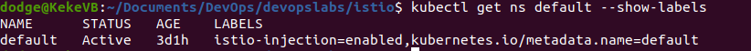
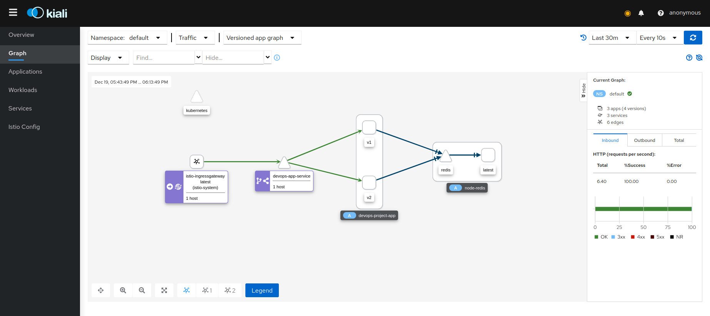

# Dev Ops Project Repository <!-- omit in toc -->

Hello. This is the repository for the DevOps project held by:

KUDINOV Sergei

# Table of Contents <!-- omit in toc -->

- [Authors](#authors)
- [Features](#features)
	- [1. Web Application](#1-web-application)
	- [2. CI/CD Pipeline](#2-cicd-pipeline)
		- [CI](#ci)
		- [CD](#cd)
			- [Azure](#azure)
			- [Netlify](#netlify)
			- [Heroku](#heroku)
				- [By a config file](#by-a-config-file)
				- [CLI](#cli)
	- [3. Vagrant, IaC](#3-vagrant-iac)
		- [Installation](#installation)
		- [Provisionning with Ansible](#provisionning-with-ansible)
		- [How to run](#how-to-run)
	- [4. Build a docker image of the web app](#4-build-a-docker-image-of-the-web-app)
		- [Create the Dockerfile](#create-the-dockerfile)
		- [Upload the image](#upload-the-image)
	- [5. Docker-compose](#5-docker-compose)
	- [6. Kubernetes](#6-kubernetes)
	- [7. Istio](#7-istio)
		- [Istio download](#istio-download)
		- [Istio installation](#istio-installation)
		- [Istio deployment using automatic envoy proxies](#istio-deployment-using-automatic-envoy-proxies)
		- [Traffic management - Open the application to outside traffic](#traffic-management---open-the-application-to-outside-traffic)
		- [Request routing](#request-routing)
		- [Traffic shifting](#traffic-shifting)
	- [8. Monitoring](#8-monitoring)
		- [Kiali](#kiali)
			- [Installation](#installation-1)
			- [Usage](#usage)
		- [Prometheus](#prometheus)
			- [Installation](#installation-2)
			- [Usage](#usage-1)
		- [Grafana](#grafana)
			- [Installation](#installation-3)
			- [Usage](#usage-2)

# Authors

We are two students contributing to this project:

| MESSALATI Yann | COTTART Kellian | 

We are from Group 1 Inter in ING 4 SI.

# Features

We will show each and every feature we have done, and the grade that comes with it. Bonus are displayed with the BNS tag.

| Subject                                                         | Code  | Grade |
| :-------------------------------------------------------------- | :---: | :---: |
| Enriched web application with automated tests                   |  APP  |  1/1  |
| Continuous Integration and Continuous Delivery (and Deployment) | CICD  |  3/3  |
| Containerisation with Docker                                    |   D   |  1/1  |
| Orchestration with Docker Compose                               |  DC   |  2/2  |
| Orchestration with Kubernetes                                   |  KUB  |  3/3  |
| Service mesh using Istio                                        |  IST  |  2/2  |
| Infrastructure as code using Ansible                            |  IAC  |  3/3  |
| Monitoring                                                      |  MON  |  2/2  |
| Accurate project documentation in README.md file                |  DOC  |  3/3  |
| TOTAL FEATURES                                                  |  TOT  | 20/20 |
| BONUS : Enriching web app with redis auto reconnection and CRUD |  BNS  |  +1   |
| BONUS : Using Kiali for dashboarding                            |  BNS  |  +1   |
| BONUS : Using Heroku CLI & Microsoft Azure & Netlify            |  BNS  | +0.5  |
| TOTAL                                                           |  TOT  | 20/20 |

Now, let's see the full explanation for every part.

## 1. Web Application

We created a web application using NodeJS storing data inside of a Redis database. 
This web application uses tests that are located inside of the `test` folder.

This application is the same as in module 04, with all of the "TODO" sections implemented.

* We also added the capacity to see if the connection with the database was succesfully executed by showing a "**redis is connected**" or "**redis not connected**" message on the front page. This was implemented thanks to [zsimo's node redis retry strategy](https://github.com/zsimo/node-redis-retry-strategy).

> https://github.com/zsimo/node-redis-retry-strategy


We can see that we check for redis status, to know whether we're connected or not.

* We brought a prettier eslinter into the project as a dev dependency using:

```
npm install --save-dev prettier-eslint
```

* We implemented update and delete operations to complete the **CRUD: Create, Read, Update, Delete**. We also implemented all the tests for the routes and the fonctions.


## 2. CI/CD Pipeline

### CI

First, we created some unit-tests inside of our app, allowing for a test suite to be created.

To implement Continuous Integration, we used GithubActions. We created the `.github/worflows/redis-docker-tests-CI.yml` file.

Using a Redis image and the repository, we set up the file to be able to run a Ubuntu using Redis, as well as a NodeJS basic system to host our file. This allows our unit-tests to run in the background on every push on the main branch.

We're checking if our app works on node 14 and 16 using a matrix strategy.

We could have implemented it on every push of all branches, however GithubActions is limited in its duration of use (only up to 3000 minutes) and we're almost over the limit, so we restrained it.

If it fails, it sends us an email, warning us about the failing of these tests.

**As of the 21/12/2021, we have used up all our github actions, so this is why it shows the tests as not working.**


### CD

#### Azure

For the CD part, we could simply use [**Microsoft Azure**](https://docs.microsoft.com/en-us/azure/app-service/quickstart-multi-container) to push our `docker-compose` file to a Microsoft server.

However, for this, we need to enter our card informations, so we decided not to use this.

After that we tried to use Netlify to implement continuous deployement.

#### Netlify

We created a netlify.toml file that download the dependencies inside the userapi folder and then executed the build command: `npm i && npm start && redis-server`

However, this implementation is stuck at the localhost part and cancels the deployement. This is due to the fact that the application is using a server while Netlify create only serverless and static deployements.


After looking at the possibilities, Netlify is not available for our application.

#### Heroku

##### By a config file

To do **Continous Deployement**, we finally used [**Heroku**](https://www.heroku.com/)

* We registered on the free part of the site, then we linked the project to the platform. There, we were asked for the name of our application, that needs to be unique inside the global heroku database. We called it `devops-app-kellian-yann`.

* Inside the account settings, we searched for the `API_KEY` and used it to configure a secret in Github:
	* We copy the `API_KEY` and go into our github repository.
	* Then we go into `Settings/Secrets` and click on `New Secret`
	* We setup the name of our secret as `HEROKU_API_KEY` and set it to the key we copied.

By doing so we finished implementing the link between Heroku and Github necessary to allow the continuous deployement.

* We created a file called `main.yml` file inside the [.github/workflows](./github/workflows) directory using the default actions for continuous deployement.

* After having setup the `app name`, `API_KEY` and register using our `email` we can then fill out the `main.yml` file correspondingly.

> Note: As we don't have anymore Github Actions credit, it doesn't allow us to do so, we have to resort to the CLI now.

##### CLI

* We downloaded [Heroku CLI](https://devcenter.heroku.com/articles/heroku-cli) because we had issues building our app and deploying it.

* We added our files to Heroku using `git remote add heroku git@heroku.com:devops-app-kellian-yann.git`

```
git remote add heroku git@heroku.com:devops-app-kellian-yann.git
```

* We generated the NodeJS buildpack to make Heroku know what type of project we are trying to build using `heroku buildpacks:set heroku/nodejs -a devops-app-kellian-yann`

```
heroku buildpacks:set heroku/nodejs -a devops-app-kellian-yann
```

* To specify that we are working in the folder `userapi`, we need to use this command at the root of our project `git subtree push --prefix userapi heroku master`

```
git subtree push --prefix userapi heroku master
```


* To update our deployment, we can use those instructions: 


Congratulations, it worked.


We cannot further develop the continuous deployement as the redis deployement requires adding credit card informations. The deployement itself will however show the disconnected warning for the redis part.

The website is accessible from [here](https://devops-app-kellian-yann.herokuapp.com/).

> https://devops-app-kellian-yann.herokuapp.com/

## 3. Vagrant, IaC

### Installation

To make the Infrastructure as Code (IaC), we downloaded Virtualbox and Vagrant following the steps in their respective tutorials :  

1. [**Virtualbox tutorial**](https://www.virtualbox.org/wiki/Downloads)
2. [**Vagrant tutorial**](https://www.vagrantup.com/downloads.html)

* We used the vagrant file in the [**assets/part-2**](https://github.com/adaltas/ece-devops-2021-fall/tree/master/courses/devops/modules/03.infrustructure-as-code/assets/part-2) folder and changed the configuration to create a ubuntu box instead of centos/7.

* We downloaded `bento/ubuntu-20.04` as our ubuntu, that you can find [here](https://app.vagrantup.com/bento/boxes/ubuntu-20.04).

* In `Powershell`, we used the command `vagrant box add bento/ubuntu-20.04` to set it up.

```
vagrant box add bento/ubuntu-20.04
```


### Provisionning with Ansible

Using Ansible, we can make a installation script in a playbook that will download the tools necessary for building the app and then download the dependencies. For this, we use five playbooks located in the [playbooks folder](IaC/playbooks/)

1. We create a shared folder between our app, and the virtual machine to be able to work on the project separately, and not have to provision the machine each time in [Vagrantfile](IaC/Vagrantfile), and we call our [orchestation-playbook.yml](IaC/playbooks/orchestration-playbook.yml).
   


2. We install the tools necessary to install redis and node. This includes **curl, make and git** in the [installation-playbook.yml](IaC/playbooks/installation-playbook.yml).


3. To run the application, it is necessary to have redis downloaded and installed, as well as started. If it isn't, the page will only show that we are not yet connected to redis. We do it using the [redis-playbook.yml](IaC/playbooks/redis-playbook.yml).


4. We need to install n, and node to have access to npm and to compile our project. This is located in [node-playbook.yml](IaC/playbooks/node-playbook.yml).


5. Now, we can simply run redis and our project as [Asynchronous tasks][https://docs.ansible.com/ansible/latest/user_guide/playbooks_async.html], running in the background of the vm allowing us to access our application easily. You can find this in [app-playbook.yml](IaC/playbooks/node-playbook.yml).


### How to run

Every step has been completed, we simply have to execute `vagrant up` in the Powershell, at the location of the [`Vagrantfile`](/Iac/Vagrantfile). The VM will setup itself.


To check if the installation was successful, and that everything is well parametered, let's do:

```
vagrant ssh
curl localhost:3000
```


**We can see that our web application is lauched and that redis is connected ! Congratulations ! It works.**

We can clean up using `vagrant destroy`.

```
vagrant destroy
```

## 4. Build a docker image of the web app

### Create the Dockerfile

* Write a [`Dockerfile`](/Dockerfile) in the main folder of the repository defining the parent image, working dir and instructions to create the image. 

* Write a [`.dockerignore`](/.dockerignore)  to be sure not to take in unwanted data

* Check if the redis connection is set to `"host": "redis"` and `"port": 6379` in [`userapi\conf\default.json`](/userapi/conf/default.json). This is only for the container part because local tests need to be run with `"host": "127.0.0.1"`.

* Build the image using `docker build -t yann-kellian-app .`


* Run the container using `docker run -p 3000:3000 -d yann-kellian-app`

* Check if it works going to `localhost:3000` or by running `docker ps`. Cool, it does.


> Note: Of course, Redis doesn't work because it is not a docker-compose. For now, it is just our base application.

* We can stop our container using `docker ps` and `docker stop [id_of_our_container]`

### Upload the image

* First, we created a repo on docker hub

* We tagged our newly created yann-kellian-app to our repo using the command `docker tag yann-kellian-app kellianoy/devops-project-app`

* We pushed our file using `docker push kellianoy/devops-project-app`

* We verified that the repo was created and full. 

> Check out: https://hub.docker.com/repository/docker/kellianoy/devops-project-app

## 5. Docker-compose

* We need to create a [`docker-compose.yaml`](docker-compose.yaml) file to orchestrate our containers. Let's start by writing it with 2 images: 
	* `redis:alpine` (because it takes less place, and we don't need much of redis) 
	* The newly-created `devops-project-app` image.
	* We add a volume named `redis-storage` to store our users.
	
* Run `docker-compose up`. Congratulations, it works !


> Note: This time, Redis works because we have the two containers communicating with each other.

* We have to check whether or not the data volume is correct, by sending post requests to create users and getting them. To do so, we used curl :

	* To create a user, you can type this command:  
	
	```
	curl -i -X POST -H 'Content-Type: application/json' -d '{"username": "kellianoy", "firstname": "kellian", "lastname":"cottart"}' http://localhost:3000/user/
	```
	
	* To get one, type this command in the url: 
	
	```
	http://localhost:3000/user/kellianoy
	``` 

* Now, we can see that the data has been persisted, even when we close the docker-compose.


* Let's clean the docker-compose by doing `docker-compose down`

## 6. Kubernetes

To begin Kubernetes, Let's install [minikube](https://kubernetes.io/fr/docs/tasks/tools/install-minikube/). Now, let's start it using `minikube start`.

We started by using `Kompose` to convert our `docker-compose.yaml` to Kubernetes deployment / service files. By using the command `kompose up .` and then `kompose convert`, we generated new files allowing to do the same deployment actions that were referred in the docker-compose.

This wasn't satisfactory, but it gave us a good idea of what to have to generate a working cluster. This result didn't allow us to make a persistent data claim, so we had to rework it into a proper deployment. This includes a total of 5 files:
	* [`k8s/web-app-deployment.yaml`](/k8s/web-app-deployment.yaml), that allows the deployment of one pod of our image
	* [`k8s/web-app-service.yaml`](/k8s/web-app-service.yaml), that allows the service of our app using a loadBalancer to be accessible from our browser
	* [`k8s/redis-deployment.yaml`](/k8s/redis-deployment.yaml), that allows the deployment of one pod of Redis
	* [`k8s/redis-service.yaml`](/k8s/redis-service.yaml), that allows the service of Redis
	* [`k8s/redis-claim.yaml`](/k8s/redis-claim.yaml), that allows the creation of a persistentVolumeClaim to make the link between database and app, and store it.
  
* To apply our files and create our cluster, we used the command `kubectl apply -f k8s/`.


* To get all the different things that were created, we have different commands:
	*`kubectl get pods`
	*`kubectl get deployments`
	*`kubectl get services`
	*`kubectl get all`

* Once it was lauched, we can use `minikube tunnel` to know the status of our machine.

* We can access the app by using `curl 10.100.85.76:3000`. (Which is the address given by the devops-app-service)

* We can add a user using :

```
curl -i -X POST -H 'Content-Type: application/json' -d '{"username": "kellianoy", "firstname": "kellian", "lastname":"cottart"}' http://10.100.85.76:3000/user/
```


> Note : If you try to do these steps again, you will have a different port number and ip.

* Let's stop the service: `minikube stop`, and open it again: `minikube start`. Now, we go to `10.100.85.76:3000/user/kellianoy` and we confirm that we have still our user in the database, meaning that it has been properly setup !

## 7. Istio

For this part, we are using the official Istio documentation:

1. [Getting Started](https://istio.io/latest/docs/setup/getting-started/)
2. [Request Routing](https://istio.io/latest/docs/tasks/traffic-management/request-routing/)
3. [Traffic Shifting](https://istio.io/latest/docs/tasks/traffic-management/traffic-shifting/)
4. [Multicluster version routing](https://istio.io/latest/blog/2019/multicluster-version-routing/)

### Istio download

* We first need to setup the resources allowed to minikube. Let's set the config to virtualbox using `minikube config set vm-driver virtualbox`. Our machines aren't really performance-oriented, so we have few elements to give. We setup minikube ressources using `minikube start --cpus 4 --memory 4096`.

```
minikube start --cpus 4 --memory 4096
```

> Note: If your computer allows it, you can start minikube using `minikube start --cpus 6 --memory 8192` or more.

* Now, we have to download Istio on the official website using this page : https://istio.io/latest/docs/setup/getting-started/#download

* Once it is downloaded, we have to add Istio to our path, using `cd istio` (depending on the name of the extracted folder) and then `export PATH=$PWD/bin:$PATH`. We can now do `istioctl` to validate the proper download and setup of Istio.

```
cd istio
export PATH=$PWD/bin:$PATH
istioctl
```


### Istio installation

* To install Itio, just enter `istioctl install`. You can check the installation by doing `kubectl get ns` which gives us all the namespaces. We can see that **istio-system** is present in the list. It also creates istio pods. We decided to go with the demo profile to allow easier configuration.

```
istioctl install
```


### Istio deployment using automatic envoy proxies

* We can create a namespace for our kubernetes cluster, **in case we have more than one**.

```
kubectl create namespace devops
```

As we only have one, we will keep on using **default**.

* First, we need to label the desired namespace of our kubernetes cluster as **istio-injection**, for istio to know which pods to implement the envoy proxies on. To do this, we have the command `kubectl label namespace default istio-injection=enabled`. To confirm it worked properly, we can show `kubectl get ns default --show-labels`. Great, everything is here.

```
kubectl label namespace default istio-injection=enabled
```

```
kubectl get ns devops --show-labels
```


  
* We can now delete all our elements in our cluster and restart them using:
	* `kubectl delete -f ./k8s` 
	* `kubectl apply -f ./k8s` 

> Note: This is done to ensure that the labelling is applied to every single element.

Now, we can check if our service has been properly deployed by trying to curl our service. We have to start by creating a link to access our service using `minikube tunnel`. Now, we need to know the cluster IP of `devops-app-service`. We can do `kubectl get services` and then, using the IP: 

```
curl 10.101.125.13:3000
```

> Note: You can also open the web browser and put the address inside.


We're having results, great ! Our Istio is set up. 

### Traffic management - Open the application to outside traffic

After setting up Istio, we have to configure the application to allow outside traffic. To do so, we need two elements:

1. Gateway
2. Virtual Service

We created a new file called [`gateway.yaml`](/istio/gateway.yaml) inside of the [istio folder](/istio/), composed of those two elements, allowing us to create a **LoadBalancer** at the start of our mesh.

To get our gateway url, we can use `minikube tunnel` and in another terminal:

```
export INGRESS_PORT=$(kubectl -n istio-system get service istio-ingressgateway -o jsonpath='{.spec.ports[?(@.name=="http2")].nodePort}')
export SECURE_INGRESS_PORT=$(kubectl -n istio-system get service istio-ingressgateway -o jsonpath='{.spec.ports[?(@.name=="https")].nodePort}')
export INGRESS_HOST=$(minikube ip)
export GATEWAY_URL=$INGRESS_HOST:$INGRESS_PORT
echo "http://$GATEWAY_URL/"
```
> Note: In our case, the address is http://192.168.49.2:32759/

We can now curl this address to check if everything is alright. Great, it works. We can also use `kubectl -n istio-system get svc istio-ingressgateway` and then go to `http://10.109.249.148/` which is the address of the LoadBalancer to show the website.


If we want to show the traffic in a Kiali dashboard, we can use this command to generate traffic and display it: 

```
for i in $(seq 1 1000); do curl -s -o /dev/null "http://$GATEWAY_URL/"; done
```


### Request routing 

We created new tags in our docker hub: v1 and v2, to specify which version we were on, testing if it works. Then, we created a second deployment of our app, and a new service. This allows us to have two deployment of the same app with different versions.

To route dynamically to multiple versions of a microservice, we have to add a key component which is called **DestinationRule** inside our `gateway.yaml`.

This allows us to link our versions to subsets that are recognized by the **VirtualService**.

### Traffic shifting 

Traffic shifting is really easy to setup, you just have to add the weight in the destination part of a virtual service.

```
 - destination:
        host: #Destination 1
        subset: v1
      weight: 80 #Percentage of people arriving here
 - destination:
        host: #Destination 2
        subset: v2
      weight: 20 #Percentage of people arriving here
```
We can curl our website several times to see if the versions are well set at 80% - 20%:


It works as intended, most versions are v1 and sometimes we get v2.

In kiali dashboard, we get:



## 8. Monitoring

### Kiali

#### Installation

* To install kiali, we have to add addons to our cluster `kubectl apply -f https://raw.githubusercontent.com/istio/istio/release-1.12/samples/addons/kiali.yaml`.

```
kubectl apply -f https://raw.githubusercontent.com/istio/istio/release-1.12/samples/addons/kiali.yaml
```

* To check the installation, we can use `kubectl -n istio-system get svc kiali`

```
kubectl -n istio-system get svc kiali
```


* Now, we need to forward the port to be able to access the Kiali dashboard:

```
kubectl port-forward svc/kiali -n istio-system 20001
```

* Go to the kiali dashboard `istioctl dashboard kiali`

```
istioctl dashboard kiali
```


#### Usage

Once in the Kiali dashboard, and with a proper Prometheus installation, we can monitor traffic on the website and the different versions.


### Prometheus 

#### Installation

* To install Prometheus, we have to add addons to our cluster `kubectl apply -f https://raw.githubusercontent.com/istio/istio/release-1.12/samples/addons/prometheus.yaml`.

```
kubectl apply -f https://raw.githubusercontent.com/istio/istio/release-1.12/samples/addons/prometheus.yaml
```

* To check the installation, we can use `kubectl -n istio-system get svc prometheus`

```
kubectl -n istio-system get svc prometheus
```


* Go to the prometheus dashboard `istioctl dashboard prometheus`

```
istioctl dashboard prometheus
```


#### Usage

Prometheus is used in pairs with Kiali, or with Grafana. It allows the creation of time-series and data modelling. It is not a tool to use on its own most of the time.

Its usage with Kiali involve all actions such as seeing the mesh and the traffic of the mesh, as we have seen in previous parts.

For instance, entering the query `istio_requests_total`, we can see how many requests were made on our mesh, allowing us to see its metrics.


There are various informations, such as which ingress-gateway is concerned, the source, the pods, the deployments, the services and so on.

### Grafana

#### Installation

* To install Grafana, we have to add addons to our cluster `kubectl apply -f https://raw.githubusercontent.com/istio/istio/release-1.12/samples/addons/grafana.yaml`.

```
kubectl apply -f https://raw.githubusercontent.com/istio/istio/release-1.12/samples/addons/grafana.yaml
```

* To check the installation, we can use `kubectl -n istio-system get svc grafana`

```
kubectl -n istio-system get svc grafana
```


* Go to the grafana dashboard `istioctl dashboard grafana`

```
istioctl dashboard grafana
```


#### Usage

We can import [istio dashboards](https://grafana.com/grafana/dashboards/7645) into Grafana to have an overview of certain components such as:

* CPU Usage
* Disk Usage
* Memory Usage


